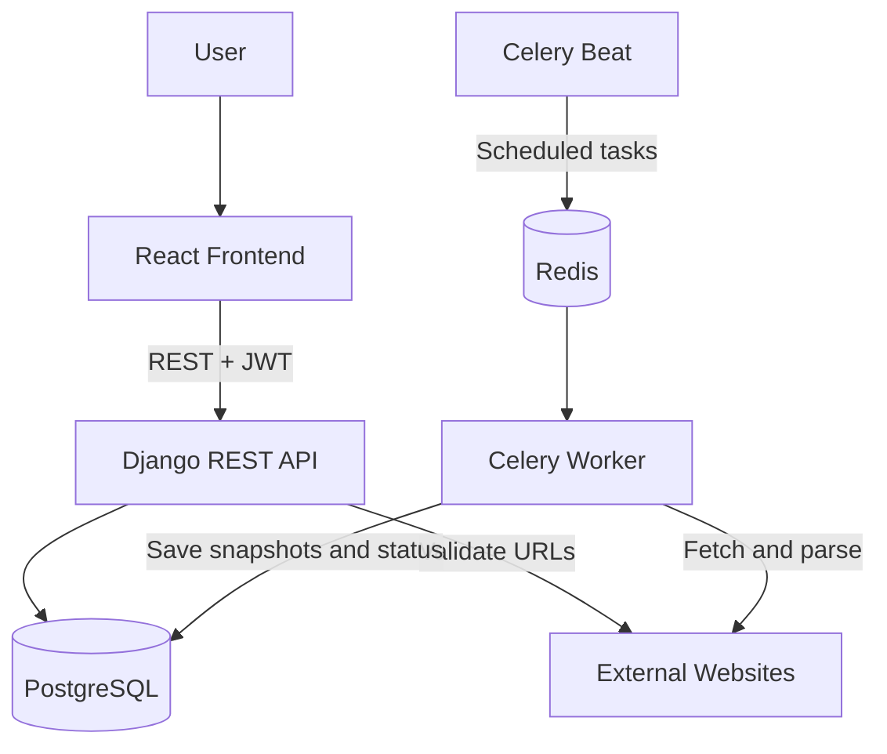
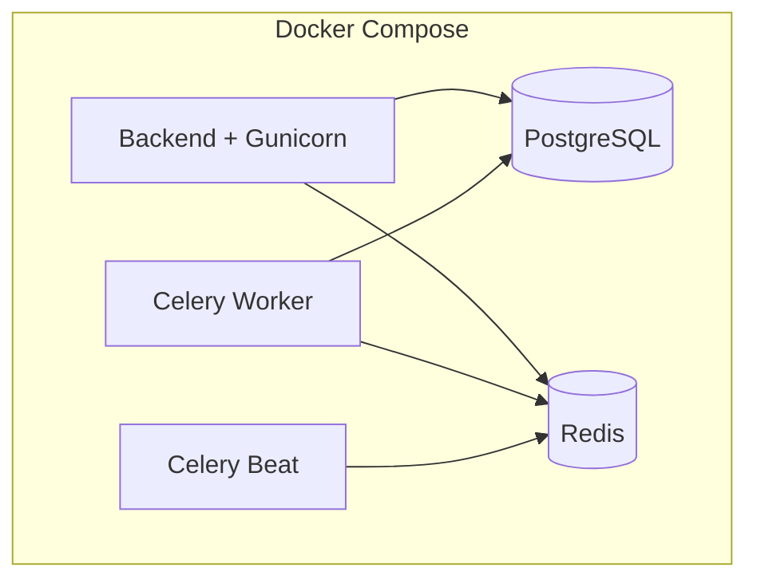
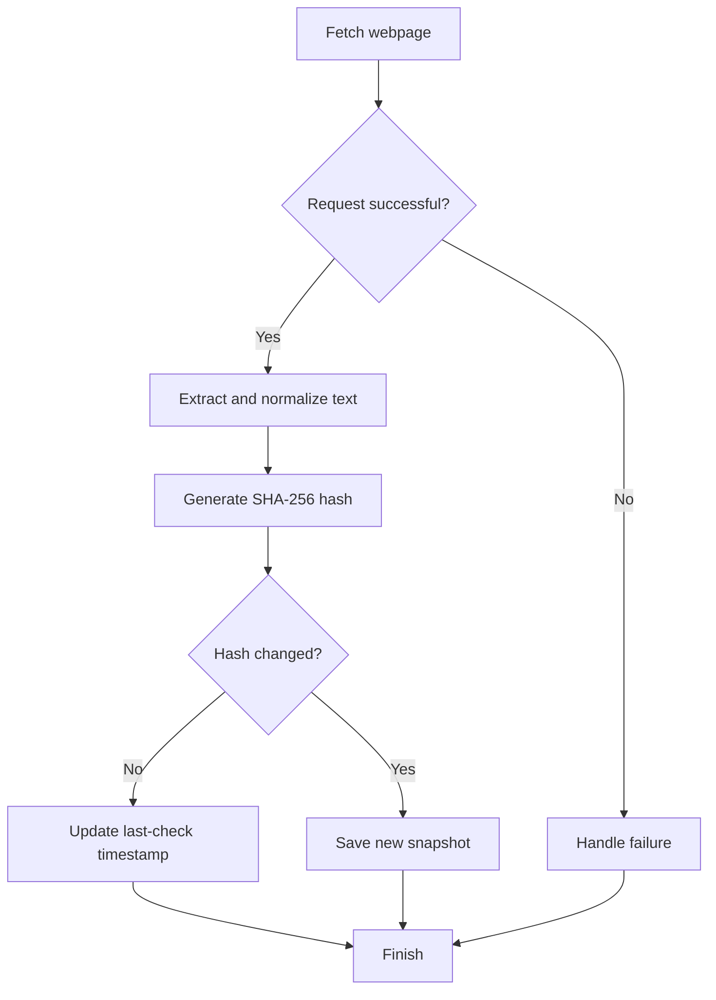
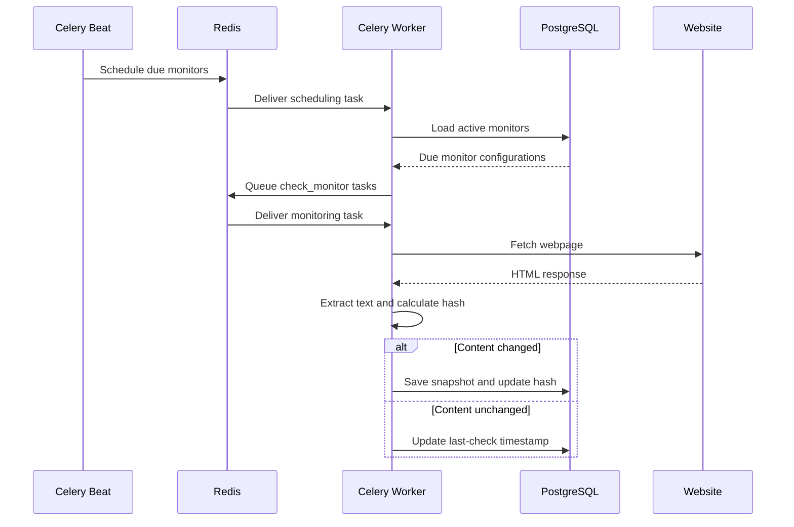
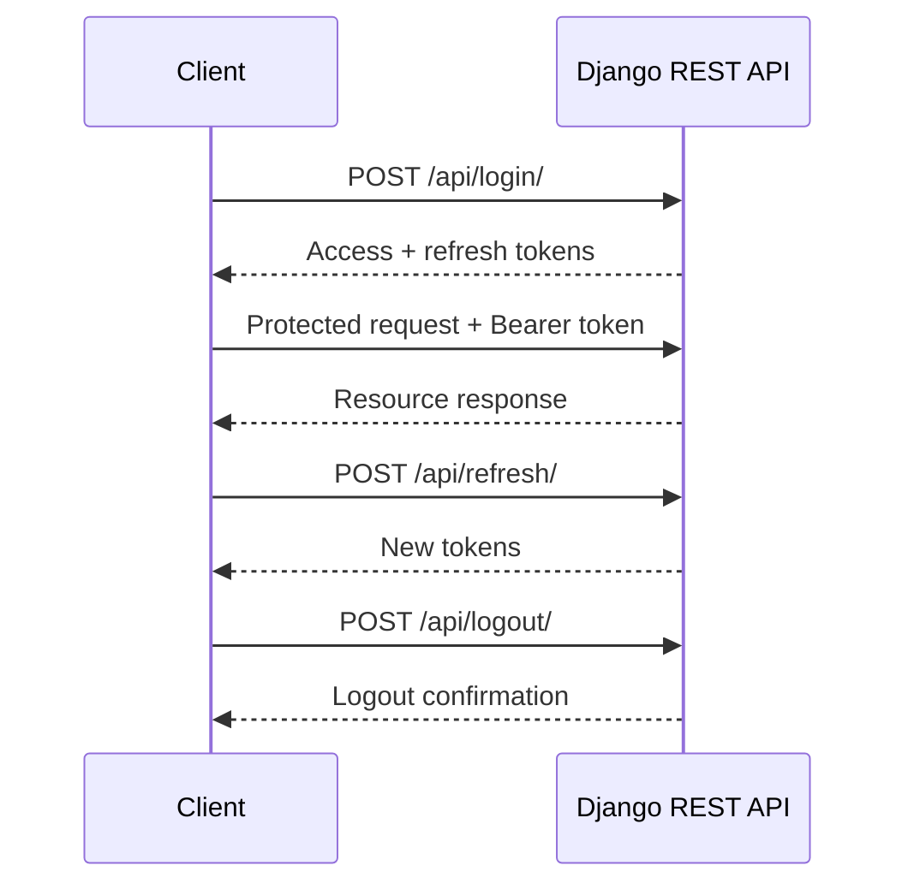
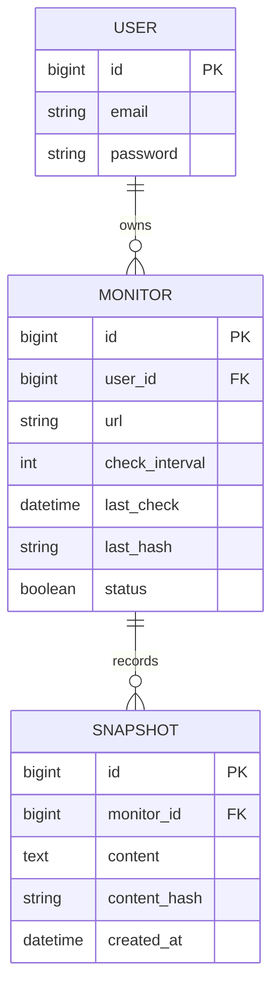
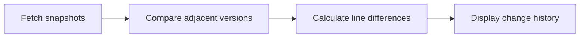

# Trackly — Website Change Monitoring

**Trackly automatically monitors web pages, detects content changes, and keeps a visual history of previous versions.**

Add a URL, choose how often it should be checked, and Trackly will periodically fetch the page, extract its text, and save a new snapshot whenever its content changes.

<p align="left">
  
  
  
  
  
  
  
  
</p>

## Features

- **Website monitoring:** Track public HTML pages with configurable check intervals (1 minute to 7 days).
- **Content extraction:** Fetch webpages and extract readable text using Requests and Beautiful Soup.
- **Change detection:** Use SHA-256 hashing to identify content changes efficiently.
- **Version history:** Store snapshots and display line-by-line differences between versions.
- **JWT authentication:** Register, log in, refresh tokens, and log out.
- **Access control:** Users can manage only their own monitors.
- **Rate limiting:** Protect authentication and API endpoints.
- **Background processing:** Run monitoring jobs asynchronously using Celery.
- **Scheduled checks:** Use Celery Beat to schedule recurring tasks.
- **Docker support:** Run the backend and supporting services with Docker Compose.

## Tech Stack

| Technology | Purpose |
|---|---|
| Python, Django | Backend |
| Django REST Framework | REST API |
| Simple JWT | Authentication |
| PostgreSQL | Persistent storage |
| Celery | Background tasks |
| Celery Beat | Task scheduling |
| Redis | Celery message broker |
| Requests | HTTP requests |
| Beautiful Soup | HTML parsing |
| hashlib | SHA-256 hashing |
| pytest | Unit testing |
| React, Vite | Frontend |
| Docker, Docker Compose | Containerization |
| Gunicorn | WSGI application server |

---

## Architecture

Trackly separates API requests from scheduled monitoring jobs. Celery workers handle webpage checks in the background, allowing the API to remain responsive.



### Docker Compose Services



| Service | Responsibility |
|---|---|
| `backend` | Runs Django and database migrations |
| `db` | Stores users, monitors, and snapshots |
| `redis` | Queues background tasks |
| `celery_worker` | Executes monitoring jobs |
| `celery_beat` | Schedules periodic checks |

---

## How Change Detection Works

Trackly extracts webpage text and calculates its SHA-256 hash. The new hash is compared with the previously stored hash.



- **First check:** Save the initial snapshot.
- **Unchanged content:** Update the last-check timestamp without creating another snapshot.
- **Changed content:** Save a new snapshot and update the latest hash.

### Hash Implementation

```python
import hashlib


def generate_hash(content: str) -> str:
    return hashlib.sha256(
        content.encode("utf-8")
    ).hexdigest()
```

Change detection depends on text extraction quality. Dynamic content, advertisements, and timestamps may trigger changes that are not meaningful to the user.

---

## Background Processing with Celery

Celery Beat runs a scheduling task every minute. The scheduler identifies active monitors that are due and queues individual monitoring jobs.



**Why Celery?**

- Slow website requests do not block normal API responses.
- Monitoring runs automatically in the background.
- Individual jobs can be processed by multiple workers.
- Failures can be handled separately from user requests.

### Page Validation

The scraper checks that a page:

- Returns a successful HTTP response.
- Contains HTML rather than another content type.
- Has meaningful extracted text.
- Is not an obvious CAPTCHA, access-denied, or verification page.
- Does not appear to be a login page.
- Meets the configured minimum text-length requirement.

Trackly monitors publicly accessible pages and does not bypass authentication or website access restrictions.

---

## Authentication

Trackly uses `djangorestframework-simplejwt` for JWT-based authentication.

| Token | Lifetime | Purpose |
|---|---|---|
| Access | 120 minutes | Authorizes protected requests |
| Refresh | 7 days | Obtains new tokens |

Refresh tokens are rotated and blacklisted on logout according to the configured Simple JWT behavior.



Protected requests include:

```http
Authorization: Bearer <access_token>
```

Trackly also implements user-specific monitor ownership, duplicate URL validation, and API throttling.

---

## Database Design

Trackly uses PostgreSQL with three main entities.



- **User:** Owns monitored URLs.
- **Monitor:** Stores the URL, checking interval, active status, and latest content hash.
- **Snapshot:** Stores a version of extracted webpage text.

A snapshot is created for the initial version and whenever the page content changes. Unchanged checks do not create redundant snapshots.

---

## REST API

Base path: `/api/`

Authenticated endpoints require:

```http
Authorization: Bearer <access_token>
```

### Authentication Endpoints

| Method | Endpoint | Purpose |
|---|---|---|
| POST | `/api/register/` | Register a user |
| POST | `/api/login/` | Obtain JWT tokens |
| POST | `/api/refresh/` | Refresh tokens |
| POST | `/api/logout/` | Blacklist the refresh token |

### Monitor Endpoints

| Method | Endpoint | Purpose |
|---|---|---|
| GET | `/api/monitor/` | List the user's monitors |
| POST | `/api/monitor/` | Create a monitor |
| GET | `/api/monitor/<id>/` | Retrieve monitor details |
| PATCH | `/api/monitor/<id>/` | Update monitor settings |
| DELETE | `/api/monitor/<id>/` | Delete a monitor |
| GET | `/api/monitor/<id>/changes/` | Retrieve snapshot history |

### Example: Create a Monitor

```http
POST /api/monitor/
Content-Type: application/json
Authorization: Bearer <access_token>
```

```json
{
  "url": "https://example.com/pricing",
  "check_interval": 60
}
```

`check_interval` is measured in minutes.

### Rate Limits

| Scope | Limit |
|---|---|
| Registration | 5 requests/minute |
| Login | 10 requests/minute |
| Other anonymous requests | 100 requests/day |
| Other authenticated requests | 1,000 requests/day |

---

## Frontend

The frontend uses React 18, Vite, and React Router.

| Route | Purpose |
|---|---|
| `/login` | User login |
| `/register` | Account registration |
| `/` | Add and manage monitored URLs |
| `/monitors/:id` | View monitor details and change history |

The frontend calculates line-by-line differences between snapshots and highlights:

- **Green:** Added lines.
- **Red:** Removed lines.



---

## Project Structure

```text
trackly/
├── docker-compose.yml
├── backend/
│   ├── Dockerfile
│   ├── manage.py
│   ├── requirements.txt
│   ├── .env.example
│   ├── config/
│   │   ├── settings.py
│   │   ├── urls.py
│   │   ├── celery.py
│   │   ├── asgi.py
│   │   └── wsgi.py
│   ├── trackly/
│   │   ├── models.py
│   │   ├── serializers.py
│   │   ├── views.py
│   │   ├── urls.py
│   │   ├── tasks.py
│   │   ├── tests.py
│   │   ├── common/
│   │   │   └── throttles.py
│   │   ├── services/
│   │   │   ├── scraper.py
│   │   │   └── hash.py
│   │   └── migrations/
│   └── unit_tests.py
└── frontend/
    ├── package.json
    ├── vite.config.js
    └── src/
        ├── lib/
        ├── components/
        └── pages/
```

---

## Getting Started

### Prerequisites

**Docker setup:**
- Git
- Docker Desktop or Docker Engine with Docker Compose

**Local setup:**
- Python 3.12+
- Node.js 18+
- PostgreSQL
- Redis

### 1. Clone the Repository

```bash
git clone https://github.com/maZen04/trackly.git
cd trackly
```

## Running with Docker Compose

### 2. Configure Environment Variables

Create your local environment file:

```bash
# Windows PowerShell
Copy-Item backend/.env.example backend/.env

# Linux / macOS
cp backend/.env.example backend/.env
```

Update `backend/.env` with your database credentials and Django secret key.

### 3. Start the Backend Services

From the repository root:

```bash
docker compose up --build
```

To run in the background:

```bash
docker compose up --build -d
```

The API should be available at:

`http://localhost:8000/api/`

### 4. Start the Frontend

Open another terminal:

```bash
cd frontend
npm install
npm run dev
```

Open `http://localhost:5173/`.

### Useful Docker Commands

```bash
docker compose ps
docker compose logs -f backend
docker compose logs -f celery_worker
docker compose logs -f celery_beat
docker compose exec backend python manage.py createsuperuser
docker compose down
```

To delete the database volume and reset stored data:

```bash
docker compose down -v
```

**Warning:** This removes persisted database data.

## Running Locally

### 1. Set Up the Backend

```bash
cd backend
python -m venv venv
```

Activate the environment.

Windows PowerShell:

```powershell
.\venv\Scripts\Activate.ps1
```

Linux / macOS:

```bash
source venv/bin/activate
```

Install dependencies:

```bash
pip install -r requirements.txt
```

Create `backend/.env` from `.env.example` and configure the database and Redis connection values.

### 2. Run Migrations and Start Django

```bash
python manage.py migrate
python manage.py runserver
```

### 3. Start Celery Worker

In a separate terminal with the virtual environment activated:

```bash
cd backend
celery -A config worker --loglevel=info --pool=solo
```

The `--pool=solo` option is useful for Windows development.

### 4. Start Celery Beat

In another terminal:

```bash
cd backend
celery -A config beat --loglevel=info
```

Ensure Redis and PostgreSQL are running.

### 5. Start the Frontend

From the repository root:

```bash
cd frontend
npm install
npm run dev
```

### Build the Frontend

```bash
cd frontend
npm run build
```

The generated static files are placed in `frontend/dist/`.

---

## Testing

### Run API Tests

From `backend/`:

```bash
python manage.py test
```

### Run Scraper and Hash Tests

```bash
pytest unit_tests.py -v
```

Unit tests should mock HTTP responses where appropriate so they can run without relying on external websites.

---

## Environment Variables

Configure these values in `backend/.env`, using the actual names and defaults defined by the project.

| Variable | Purpose |
|---|---|
| `DJANGO_SECRET_KEY` | Django signing key |
| `DJANGO_DEBUG` | Debug mode |
| `DJANGO_ALLOWED_HOSTS` | Allowed hostnames |
| `POSTGRES_DB` | Database name |
| `POSTGRES_USER` | Database username |
| `POSTGRES_PASSWORD` | Database password |
| `POSTGRES_HOST` | Database hostname |
| `POSTGRES_PORT` | Database port |
| `CELERY_BROKER_URL` | Redis broker URL |
| `CELERY_RESULT_BACKEND` | Celery result backend URL |

Generate a secret key with:

```bash
python -c "from django.core.management.utils import get_random_secret_key as g; print(g())"
```

Never commit real credentials or production secrets. Disable Django debug mode in production.

---

## Future Improvements

- Telegram messages when changes are detected.
- Pause and resume monitoring.
- Compare any two snapshots.
- Word-level change highlighting.
- CSS-selector-based content monitoring.
- Retry policies for temporary network failures.
- CI/CD workflows and expanded integration testing.

---
## 👤 Author

**Mazen Ayman** — Backend developer focused on Python, Django, REST APIs, and distributed backend systems.
[GitHub](https://github.com/maZen04) · [LinkedIn](https://www.linkedin.com/in/mazen-ayman-8409b5356/)


**Trackly — Monitor less manually. Know when your websites change.**
