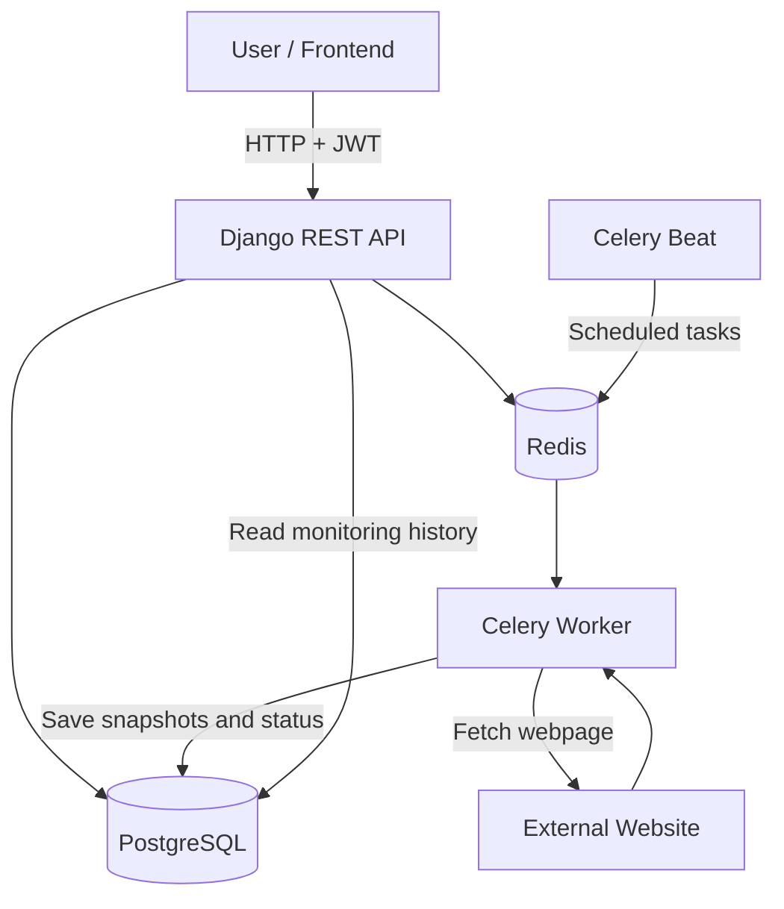
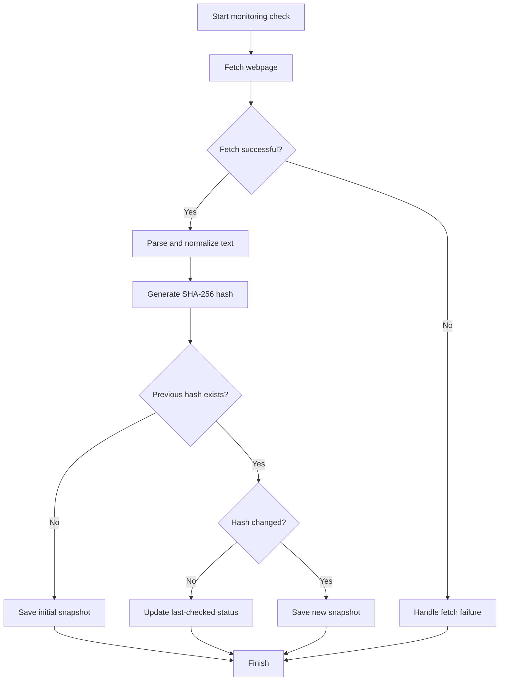
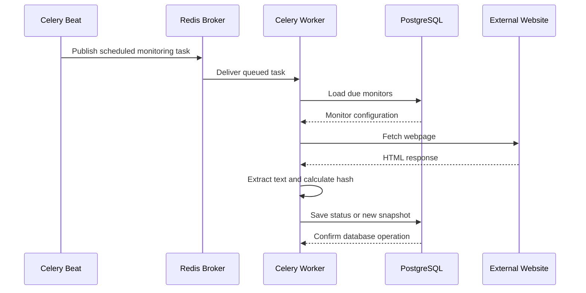
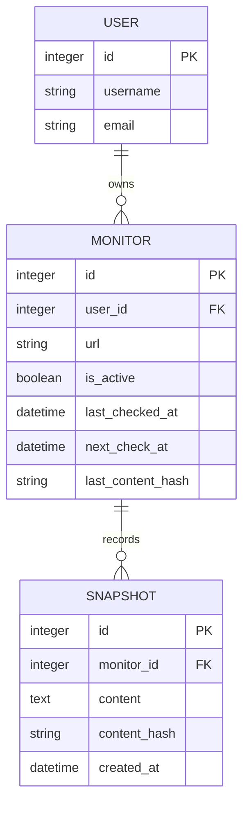
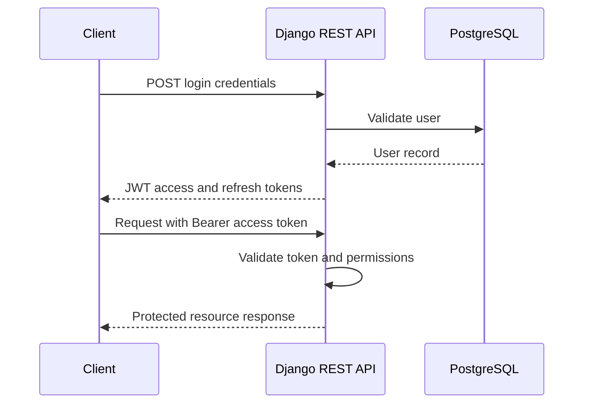
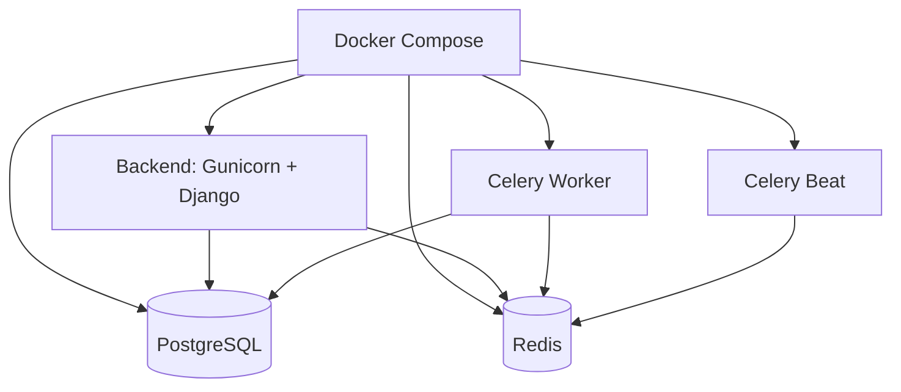

# Trackly — Website Change Monitoring API

Trackly is a Django REST API that monitors webpages for content changes. Users can register URLs, periodically check their content, and review a history of detected changes.

Instead of repeatedly checking websites manually, Trackly automates the monitoring process using **Celery** for background tasks, **Redis** for task queuing, and **PostgreSQL** for persistent storage.

## Table of Contents

- [Overview](#overview)
- [Features](#features)
- [Tech Stack](#tech-stack)
- [System Architecture](#system-architecture)
- [How Change Detection Works](#how-change-detection-works)
- [Celery Background Processing](#celery-background-processing)
- [Database Design](#database-design)
- [API Overview](#api-overview)
- [Project Structure](#project-structure)
- [Getting Started](#getting-started)
- [Running with Docker](#running-with-docker)
- [Testing](#testing)
- [Environment Variables](#environment-variables)
- [Future Improvements](#future-improvements)

## Overview

Websites frequently update their content. This can include new freelance projects, job listings, articles, product information, or other information that users want to follow.

Trackly provides an automated way to monitor these changes:

1. A user registers and adds a URL to monitor.
2. Trackly fetches the webpage and extracts its relevant text.
3. The extracted content is normalized and hashed.
4. A background task periodically checks the URL again.
5. If the content hash differs from the previous hash, Trackly records a new snapshot.
6. Users can review the detected changes through the API.

## Features

- **User authentication:** Registration and JWT-based authentication.
- **URL monitoring:** Manage webpages that should be checked periodically.
- **Content scraping:** Fetch webpage content and extract text for comparison.
- **Change detection:** Use SHA-256 hashes to identify content changes efficiently.
- **Change history:** Store snapshots when monitored content changes.
- **Asynchronous processing:** Execute monitoring tasks through Celery workers.
- **Scheduled monitoring:** Use Celery Beat to schedule periodic checks.
- **Persistent storage:** Use PostgreSQL for application data and Redis for task queuing.
- **Automated testing:** Test scraping and change-detection behavior with pytest.
- **Containerization:** Run the application and its supporting services with Docker Compose.

## Tech Stack

| Technology | Purpose |
|---|---|
| Python | Core programming language |
| Django | Application framework |
| Django REST Framework | REST API development |
| Simple JWT | JWT authentication |
| PostgreSQL | Persistent application data |
| Celery | Background task execution |
| Celery Beat | Periodic task scheduling |
| Redis | Celery message broker and result backend |
| Requests | HTTP requests to monitored websites |
| Beautiful Soup | HTML parsing and text extraction |
| pytest | Automated testing |
| Docker & Docker Compose | Containerization and service orchestration |
| Gunicorn | Production WSGI application server |

## System Architecture

The application separates HTTP request handling from background monitoring tasks. This allows the API to remain responsive while workers perform webpage requests and content comparisons.



### Main Components

- **Django REST API:** Handles authentication, monitor management, validation, and API responses.
- **PostgreSQL:** Stores application data, monitoring configuration, and recorded snapshots.
- **Redis:** Acts as the Celery message broker and result backend.
- **Celery Worker:** Executes monitoring jobs outside the request-response cycle.
- **Celery Beat:** Publishes scheduled monitoring tasks.
- **External websites:** The pages Trackly fetches and monitors.

## How Change Detection Works

Trackly uses content hashing to avoid storing a complete snapshot every time a page is checked.



### Hash Generation

The content hash is generated using Python's `hashlib` module:

```python
import hashlib


def generate_hash(content: str) -> str:
    return hashlib.sha256(
        content.encode("utf-8")
    ).hexdigest()
```

The monitoring process compares the new hash with the previously stored hash.

- **Same hash:** The normalized content has not changed.
- **Different hash:** The content has changed, so a new snapshot can be recorded.
- **No previous hash:** The first successful check establishes the initial baseline.

Hashing is efficient because Trackly can compare fixed-length digests rather than repeatedly comparing large text bodies.

> The reliability of change detection depends on text extraction and normalization. Dynamic content, timestamps, advertisements, or frequently changing page elements can create changes that are not meaningful to the user.

## Celery Background Processing

Web scraping can be slow because external websites may respond slowly, fail temporarily, or impose request limits. Performing every check synchronously inside an API request would make responses slower and less reliable.

Trackly uses Celery to move monitoring work into background workers.



### Responsibilities

| Component | Responsibility |
|---|---|
| Celery Beat | Schedules periodic monitoring tasks |
| Redis | Queues tasks until workers consume them |
| Celery Worker | Fetches pages and detects changes |
| PostgreSQL | Stores monitoring state and history |

### Why Use Celery?

- Slow external requests do not need to block API responses.
- Monitoring can run automatically on a schedule.
- Failed checks can be handled separately from user requests.
- Additional workers can be introduced as the workload grows.

Redis is used for task messaging, while PostgreSQL remains the persistent source of application data.

## Database Design

The following diagram represents the **conceptual data model** for Trackly. Actual model names and fields should match the Django models implemented in the repository.



### Main Entities

**User**
- Represents an authenticated Trackly user.
- Owns the URLs they monitor.

**Monitor**
- Represents a webpage being monitored.
- Stores the URL and monitoring state.
- Can retain scheduling information and the latest content hash.

**Snapshot**
- Represents a recorded version of the extracted page content.
- Is associated with a monitor.
- Allows the application to retain a history of detected changes.

The exact schema depends on the current Django models. For example, if the implementation stores snapshots only when a change occurs, the history represents detected changes rather than every scheduled check.

## API Overview

Trackly exposes a REST API for authentication and website monitoring. The route names below are a proposed documentation map; verify the exact URL paths against `config/urls.py` and `trackly/urls.py` before publishing them as definitive endpoint documentation.

### Authentication

| Method | Example endpoint | Purpose |
|---|---|---|
| POST | `/api/auth/register/` | Register a user |
| POST | `/api/auth/login/` | Obtain JWT tokens |
| POST | `/api/auth/refresh/` | Refresh an access token |
| POST | `/api/auth/logout/` | Log out or invalidate a refresh token, if implemented |

### Monitor Management

| Method | Example endpoint | Purpose |
|---|---|---|
| GET | `/api/monitors/` | List the user's monitors |
| POST | `/api/monitors/` | Add a URL to monitor |
| GET | `/api/monitors/<id>/` | Retrieve monitor details |
| PATCH | `/api/monitors/<id>/` | Update monitor settings |
| DELETE | `/api/monitors/<id>/` | Remove a monitor |
| GET | `/api/monitors/<id>/history/` | Retrieve recorded snapshots, if implemented |

Replace these example paths with the exact routes exposed by the current application. An endpoint should only be listed if it is actually implemented.

### Authentication Flow



Protected requests typically include the access token in the HTTP header:

```http
Authorization: Bearer <access_token>
```

Use the token format and authentication behavior configured in the project.

## Project Structure

The backend structure is organized around Django configuration, application logic, background tasks, and tests.

```text
trackly/
├── config/
│   ├── __init__.py
│   ├── asgi.py
│   ├── celery.py
│   ├── settings.py
│   ├── urls.py
│   └── wsgi.py
├── trackly/
│   ├── common/
│   ├── migrations/
│   ├── services/
│   ├── models.py
│   ├── serializers.py
│   ├── tasks.py
│   ├── tests.py
│   ├── urls.py
│   └── views.py
├── manage.py
├── requirements.txt
├── unit_tests.py
└── test_diff.py
```

This tree describes the backend package. If the repository includes a separate frontend or a Docker Compose file at the repository root, include those paths in the final tree as well.

## Getting Started

### Prerequisites

- Python 3.12
- PostgreSQL
- Redis
- Git

Docker Desktop is recommended for running the complete stack without manually installing PostgreSQL and Redis.

### 1. Clone the Repository

```bash
git clone https://github.com/maZen04/trackly.git
cd trackly
```

If the Django backend is inside a `backend/` directory, enter that directory before running the following Python commands:

```bash
cd backend
```

### 2. Create a Virtual Environment

Windows PowerShell:

```powershell
python -m venv venv
.\venv\Scripts\Activate.ps1
```

Install dependencies:

```powershell
pip install -r requirements.txt
```

### 3. Configure Environment Variables

Create a `.env` file in the directory expected by your local configuration. Do not commit this file to Git.

Example:

```env
DJANGO_SECRET_KEY=replace-with-a-new-secret-key
DJANGO_DEBUG=True
DJANGO_ALLOWED_HOSTS=localhost,127.0.0.1

POSTGRES_DB=trackly_db
POSTGRES_USER=trackly_user
POSTGRES_PASSWORD=replace-with-a-strong-password
POSTGRES_HOST=localhost
POSTGRES_PORT=5432

CELERY_BROKER_URL=redis://localhost:6379/0
CELERY_RESULT_BACKEND=redis://localhost:6379/0
```

The application must explicitly load `.env` values or receive them from the shell. A `.env` file is not automatically loaded into the Django process unless the project is configured to do so.

Generate a new Django secret key rather than reusing a development or published value.

### 4. Apply Database Migrations

Ensure PostgreSQL is running and the database exists, then run:

```bash
python manage.py migrate
```

### 5. Start the API

```bash
python manage.py runserver
```

The local API will normally be available at:

```text
http://127.0.0.1:8000/
```

### 6. Start Redis and Celery

In separate terminals, with the virtual environment activated and the correct Django settings available:

```bash
celery -A config worker --loglevel=info
```

Start the scheduler:

```bash
celery -A config beat --loglevel=info
```

On Windows, the project may use `--pool=solo` for the worker:

```bash
celery -A config worker --loglevel=info --pool=solo
```

Make sure Redis is running and the broker URL points to the correct address for your environment.

## Running with Docker

Docker Compose can run the application and its supporting services together.

### Services



| Service | Purpose |
|---|---|
| `backend` | Runs Django through Gunicorn and applies migrations |
| `db` | Runs PostgreSQL with a persistent volume |
| `redis` | Provides the Celery broker and result backend |
| `celery_worker` | Processes background jobs |
| `celery_beat` | Schedules recurring monitoring jobs |

From the directory containing `compose.yaml` or `docker-compose.yml`, validate the configuration:

```bash
docker compose config
```

Build and start the services:

```bash
docker compose up --build
```

Run them in the background:

```bash
docker compose up --build -d
```

Check service status:

```bash
docker compose ps
```

View backend logs:

```bash
docker compose logs -f backend
```

View Celery worker logs:

```bash
docker compose logs -f celery_worker
```

Stop the services:

```bash
docker compose down
```

The named PostgreSQL volume preserves database data when containers are stopped or recreated. Avoid deleting volumes unless you intentionally want to remove the stored data.

### Docker Networking

Inside Docker Compose, containers should use service names to communicate:

- PostgreSQL host: `db`
- Redis host: `redis`

For local development from Windows, use the host-accessible PostgreSQL and Redis addresses instead. The correct values depend on where those services are running.

## Testing

Trackly includes tests for core backend behavior, including scraping and content-hash generation.

Run the project's pytest suite from the directory containing the test files:

```bash
pytest -v
```

To run a specific test module:

```bash
pytest unit_tests.py -v
```

```bash
pytest test_diff.py -v
```

Tests that make real HTTP requests require working network access and reachable target websites. For more reliable automated testing, mock external HTTP responses in unit tests and keep a smaller set of integration tests for real-world behavior.

## Environment Variables

| Variable | Purpose |
|---|---|
| `DJANGO_SECRET_KEY` | Django cryptographic signing key |
| `DJANGO_DEBUG` | Enables or disables debug mode |
| `DJANGO_ALLOWED_HOSTS` | Allowed hostnames for Django |
| `POSTGRES_DB` | PostgreSQL database name |
| `POSTGRES_USER` | PostgreSQL username |
| `POSTGRES_PASSWORD` | PostgreSQL password |
| `POSTGRES_HOST` | Database hostname |
| `POSTGRES_PORT` | Database port |
| `CELERY_BROKER_URL` | Celery message broker URL |
| `CELERY_RESULT_BACKEND` | Celery result backend URL |

Keep secrets out of source control. In production, disable Django debug mode, configure allowed hosts explicitly, and use strong credentials.

## Future Improvements

Potential extensions for Trackly include:

- Telegram notifications when meaningful changes are detected.
- Configurable monitoring intervals.
- Retry policies and better handling of failed requests.
- Per-user limits on the number of monitored URLs.
- Improved filtering of dynamic page content.
- Monitoring dashboards and change summaries.
- Deployment automation and continuous integration.
- More integration tests for the API, Celery tasks, and database interactions.

